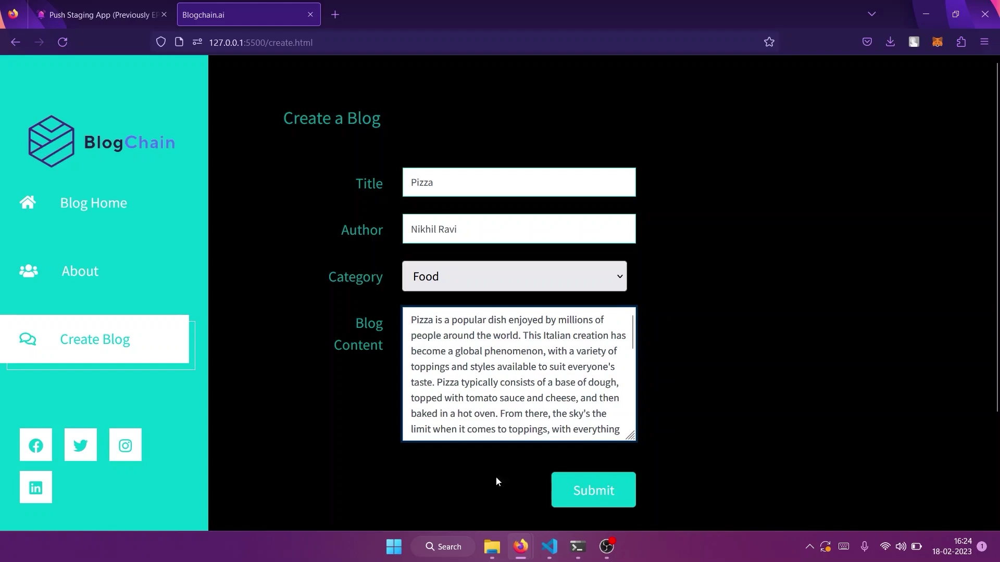

# BlogChain.ai - EthforAll
Blogs are a forum for individuals and organisations to communicate their thoughts, ideas, and experiences with an audience from all over the world. They have become an irreplaceable medium of sharing information in the modern era, but due to reduced attention spans, many find it difficult to sit through walls of text without any illustrations, leading to limited reach and comprehensibility of the content. According to research, image-based blogs have higher user engagement and readership than text-based blogs as they appeal to visual learners better.

Through **BlogChain.ai**, we hope to help both bloggers and readers have a better experience in posting and consuming content on the internet. Want to increase traffic on your blogs or get the entire gist of the content in a few seconds? Don't worry, we've got your back.

**BlogChain.ai** is a web3 based blogging platform which integrates the powerful generative capabilities of AI into blockchain. Our AI specially generates images which are used as NFTs and are oriented towards the written material of the blog. This enables bloggers to make their writing visually appealing, while also making a unique NFT based on the highlighted content in the blog. Our platform creates an NFT using the cover image of the blog and encodes the blog text into the image using **image steganography**. This helps users share their content using a single NFT, thus **increasing the shareability and readability** of these blogs.

This has been developed using web 3.0 technologies that enable decentralization, personalization, immersiveness, and a token-driven economy. It provides user with a personalized web surfing experience. The project aims at making blog sharing decentralised using web 3.0 technologies like **FVM**, **Arcana**, **IPFS**, **PUSH Protocol**, **Chainlink** etc.

## Project demonstration 

Here's our [project demonstration](https://www.youtube.com/watch?v=l_Xdm4_CgmQ) on youtube. 

1. Home page of BlogChain.ai - This page displays the latest blogs with their NFTs on our platform.
    
    

2. Arcana Authentication - To use the features of our website a user authentication is required, this is done using Arcana Authentication SDK.
    
    

3. Create Blog -  Once logged in, users can create blogs on our platform, user only has to provide only the blog content.
    
    

4. Push Notification - On blog creation a Push Notification of the cover image NFT along with relevant blog details is sent to the channel delegates.
    
    

5. Blog view - The blogs on the home page can be viewed along with cover image NFT, blog content and other AI generated images. 
    
    
    
The detailed explanation of each technology used in this project is as follows. 

## Technologies used for development - 

- ### Arcana : 

BlogChain.ai values user privacy and makes sure that the blog content isn't plagiarised and reused. This is doubly ensured by the blockchain being used and the unique NFTs that are generated, based on the content of the blog. Since user authentication is one of the most important features for our website, the usage and creation of blogs on our platform requires a valid user, and this is confirmed by the authentication mechanism powered by Arcana.

We integrated ARCANA SDK for user authentication in our website. It enables a familiar web2 user onboarding experience in our web3 application. The user is required to login to access the features of the website, such as to read and create blogs. The user can create visually appealling blog images by creating NFTs with the blog content only after verification. Users can either use their google account or email id to login and use the features of the platform.

The implementation of Arcana SDK in our project is shown in the following demo:

[Arcana implementation in project](https://www.youtube.com/watch?v=XMHn-AmlLaI)

- ### PUSH Protocol : 

After successful authentication, the user can create a blog which is processed on the backend to generate an AI image and this, in turn, is used to create an NFT. This NFT is minted with the smart contract deployed to FVM. Once the NFT is minted, it generates a PUSH notification that is sent to all the users across the channel. The PUSH notification shows the members the details of the blog as well as the NFT image.

Here, is a demonstration of PUSH notifications implemented in the project to send notifications to all users about the newly minted NFTs and the created blogs:-

[Push protocol implementation in project](https://youtu.be/OSp0tJwj0WU)

- ### Chainlink : 

Our project focuses on creating NFTs from AI generated images using specific keywords for a blog. This process can prove to be expensive on the blockchain, and hence we implemented Chainlink for it to be handled off-chain. We used Chainlink to access a custom created external api, which was hosted online to perform the computations and load the data onto the blockchain.
A Chainlink bridge was implemented and hosted locally using a docker container.

Here, is the demonstration of Chainlink into the project to provide data and information from off-blockchain sources to on-blockchain smart contracts:-

- ### IPFS :

Storage is an important aspect of our site, and we have used IPFS for all our storage needs. From the specially generated images by our AI to the unique NFTs minted off-chain and the contents of the blogs - we have implemented IPFS as our decentralized web3 storage solution. As IPFS is the standard for many storage services, dedicated IPFS servers for NFT.Storage will safely store the data required and keep the NFTs secure, along with all the other material from the blogs. 

- ### FVM : 

BlogChain.ai creates AI generated images for blogs which are then converted to NFTs. This NFT is encoded with the blog text and uploaded onto NFT.Storage, using the api to get the CID. Once the NFT is uploaded, it is minted using smart contracts, which are deployed on File Coin Virtual Machine (FVM) to generate the accessible link. This link is the NFT which is stored in IPFS and is used to display the NFT on PUSH notifications, as well as on the website. 

The smart contract is deployed on FVM, and is based on ERC721 contract. This provides a standard for representing ownership of non - fungible tokens (NFTs), with guidelines and methods for minting NFTs.

**The deployed FVM Contract address is as follows  0x70182549ad11ac347E74aFbAcCbF0bC4b779fA90**

[Contract deployment confirmation on filfox](https://hyperspace.filfox.info/en/address/0x70182549ad11ac347E74aFbAcCbF0bC4b779fA90)

[Chainlink and FVM implementation in project youtube video](https://youtu.be/y3vJxndO7gA)

## Our unique value proposition.
   Unlike regular NFTs our NFT is an aggregation of AI generated images and blog content, the blog content is encoded into the AI generated image using        image steganography and can be decoded with the similar software using the password set by the user. Hence these blogs can be shared using the NFT image    only. 
